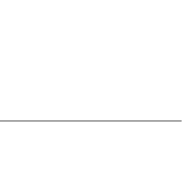
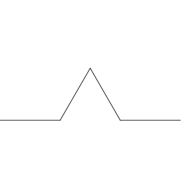
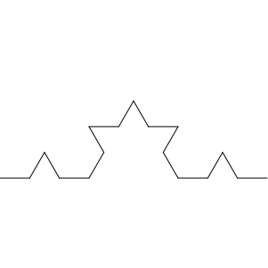
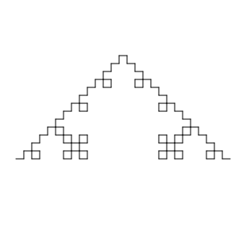
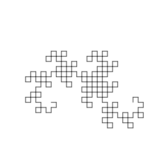

# Project 2: Fractal Explorations

**COMP 360: Programming Languages**

---

## Expected Effort

This project is difficult! If you aren't able to complete the project, I expect you to spend at least 7 hours and as many as 10 hours. If you can't complete the project within 10 hours, you should let yourself stop working. 

Your effort now will pay off in the future.

---

## AI Assistance Disclosure

**You must disclose use of AI on this assignment.** If you opt to use AI for this project, I will ask to see your conversation history.

---

## Grading and Submission

This project is **due the week of Feb 9**. You can bring me your code anytime that week during my office hours. Grading should take no more than 10 minutes.

Your grade will be based on how much of the project you completed, how much time you spent, and how well you understand your own code.

My solutions will become avaiable on Feb 13.

---

## Overview

In this project, you'll explore fractals using recursion, higher-order functions, and functional programming in Racket. You'll implement multiple fractal generation techniques.

Fractals are geometric patterns that repeat at every scale. They appear throughout nature (ferns, coastlines, snowflakes) and have deep connections to mathematics and computer science. More importantly for us, they're great practice for recursive thinking!

---

## Getting Started

Open `project2.rkt`. You'll see:

```racket
#lang racket
(require 2htdp/image)
(require lang/posn)
```

The `2htdp/image` library provides the graphics primitives you'll need. Key functions you'll use:

- `(add-line img x1 y1 x2 y2 color)` - draw a line on an image
- `(place-image img x y background)` - place an image on a background
- `(rectangle width height mode color)` - create a rectangle

I'm also providing a helper function that draws polygons using our pair-based points:

```racket
;; draw-polygon: list of points (pairs), mode ("solid" or "outline"), color -> image
;; Draws a polygon using a list of (cons x y) points
(define (draw-polygon image points mode color)
  (add-polygon image (map (lambda (p) (make-posn (car p) (cdr p))) points)
               mode
               color))
```

---

## Part 1: Foundation - Point and Line Helpers

Before building fractals, you need utility functions for working with points and lines. A **point** is represented as a cons pair: `(cons x y)`.

### Problem 1.1: midpoint

Write a function `midpoint` that takes two points and returns the point exactly between them.

```racket
(midpoint (cons 0 0) (cons 100 100))   ; => (cons 50 50)
(midpoint (cons 0 0) (cons 50 0))      ; => (cons 25 0)
(midpoint (cons 0 0) (cons 0 80))      ; => (cons 0 40)
(midpoint (cons 10 20) (cons 30 40))   ; => (cons 20 30)
(midpoint (cons -10 -10) (cons 10 10)) ; => (cons 0 0)
(midpoint (cons 5 5) (cons 5 5))       ; => (cons 5 5)
```

### Problem 1.2: point-at-fraction

Write a function `point-at-fraction` that takes two points and a fraction `t` (between 0 and 1), returning the point that is `t` of the way from the first point to the second.

```racket
(point-at-fraction (cons 0 0) (cons 100 0) 0)     ; => (cons 0 0)
(point-at-fraction (cons 0 0) (cons 100 0) 0.25)  ; => (cons 25 0)
(point-at-fraction (cons 0 0) (cons 100 0) 0.5)   ; => (cons 50 0)
(point-at-fraction (cons 0 0) (cons 100 0) 0.75)  ; => (cons 75 0)
(point-at-fraction (cons 0 0) (cons 100 0) 1.0)   ; => (cons 100 0)
(point-at-fraction (cons 0 0) (cons 100 100) 0.5) ; => (cons 50 50)
(point-at-fraction (cons 0 0) (cons 0 200) 0.25)  ; => (cons 0 50)
(point-at-fraction (cons 10 10) (cons 50 90) 0.5) ; => (cons 30 50)
(point-at-fraction (cons 100 0) (cons 0 0) 0.5)   ; => (cons 50 0)
```

*Hint:* The formula is: `result = p1 + t * (p2 - p1)`, applied to both x and y components.

### Problem 1.3: rotate-point

Write a function `rotate-point` that takes a point, a center point, and an angle in radians. It returns the point rotated around the center by that angle.

*Note:* Results involve floating-point arithmetic. Values shown are approximate.

```racket
; Rotate around the origin (no rotation)
(rotate-point (cons 1 0) (cons 0 0) 0)            ; => (cons 1.0 0.0)

; 90-degree rotations around origin
(rotate-point (cons 1 0) (cons 0 0) (/ pi 2))     ; => (cons 0.0 1.0) approximately
(rotate-point (cons 1 0) (cons 0 0) pi)           ; => (cons -1.0 0.0) approximately
(rotate-point (cons 1 0) (cons 0 0) (* 3/2 pi))   ; => (cons 0.0 -1.0) approximately
(rotate-point (cons 0 1) (cons 0 0) (/ pi 2))     ; => (cons -1.0 0.0) approximately

; Larger radius
(rotate-point (cons 5 0) (cons 0 0) (/ pi 2))     ; => (cons 0.0 5.0) approximately
(rotate-point (cons 10 0) (cons 0 0) pi)          ; => (cons -10.0 0.0) approximately

; Rotate around a different center
(rotate-point (cons 2 0) (cons 1 0) (/ pi 2))     ; => (cons 1.0 1.0) approximately
(rotate-point (cons 3 1) (cons 1 1) pi)           ; => (cons -1.0 1.0) approximately
(rotate-point (cons 10 5) (cons 5 5) (/ pi 2))    ; => (cons 5.0 10.0) approximately
(rotate-point (cons 6 4) (cons 4 4) (/ pi 2))     ; => (cons 4.0 6.0) approximately

; 60-degree rotation (important for Koch curve!)
(rotate-point (cons 1 0) (cons 0 0) (/ pi 3))     ; => (cons 0.5 0.866) approximately
(rotate-point (cons 1 0) (cons 0 0) (- (/ pi 3))) ; => (cons 0.5 -0.866) approximately
```

*Hint:* The rotation algorithm is:
1. Translate the point so the center is at the origin
2. Apply rotation: `x' = x*cos(angle) - y*sin(angle)`, `y' = x*sin(angle) + y*cos(angle)`
3. Translate back

### Problem 1.4: draw-line

Write a function `draw-line` that takes two points, a color, and a background image. It returns the background with a line drawn between the points.

```racket
; These produce images - visually inspect the output
(draw-line (cons 0 0) (cons 100 100) "black" (rectangle 200 200 "solid" "white"))
(draw-line (cons 50 0) (cons 50 100) "red" (rectangle 100 100 "solid" "white"))
(draw-line (cons 0 50) (cons 100 50) "blue" (rectangle 100 100 "solid" "white"))
(draw-line (cons 10 10) (cons 90 90) "green" (rectangle 100 100 "solid" "gray"))
```

*Hint:* Use `add-line` from `2htdp/image`. Note that `add-line` takes individual x,y coordinates, not points.

---

## Part 2: Classic Recursive Fractals

These fractals are defined recursively: the whole is made of smaller copies of itself.

### Problem 2.1: Sierpinski Triangle

The **Sierpinski triangle** is one of the most famous fractals. It's constructed by:
- **Base case (depth 0):** Draw a filled triangle
- **Recursive case:** Draw three smaller Sierpinski triangles at the three corners of the current triangle


Write a function `sierpinski-triangle` that takes three corner points and a depth:

```racket
(define (sierpinski-triangle p1 p2 p3 depth)
  ...)
```

**Strategy:**
1. Define a background image
2. Define a recursive helper function which:

   a. Takes in three points, a depth, and an image

   b. If the depth is 0: draw a polygon (see my helper function) on the image

   c. Otherwise: recursively call the helper with the following structure:

   ```racket
   (helper p1 mp2 mp3 
          (helper mp1 p2 mp3 
                  (helper mp1 mp2 3)))
   ```

   Notice that the `image` argument to the helper is a yet another recursive call, whose own `image` argument is yet a third recursive call.

   `mpx` represents the midpoint. Use the midpoint function from earlier.

3. Call the recursive helper function with the defined background as the `image`.

Test with:
```racket
(sierpinski-triangle (cons 250 50) (cons 50 400) (cons 450 400) 5)
```

**Your function MUST be fast!** If it is slow, you will not get full credit! I can run `depth = 10` in a couple of seconds.

**Extra Challenge:** define your background according to the input points so that it is always just the right size!

### Problem 2.2: Koch Curve

The **Koch curve** replaces each line segment with four segments forming a "bump":






Each new segment is 1/3 the length of the original. The "bump" is an equilateral triangle pointing outward.

Write a function `koch-curve` that takes two endpoints, a depth, and a background image:

```racket
(define (koch-curve p1 p2 depth image)
  ...)
```

**Strategy:** (no recursive helper necessary)
1. At depth 0, just draw a line from p1 to p2
2. Otherwise, find four key points (you could use `let` or maybe `let*`?):
   - `a`: 1/3 of the way from p1 to p2 (use `point-at-fraction`)
   - `b`: 2/3 of the way from p1 to p2
   - `peak`: the top of the bump (rotate point `b` around point `a` by 60 degrees or `(- (/ pi 3))` radians)
3. Recursively draw four Koch curves: p1→a, a→peak, peak→b, b→p2. Do this by nesting recursive calls so that the first call's `image` argument is the result of the second call, and so on.

### Problem 2.3: Koch Snowflake

A **Koch snowflake** is three Koch curves arranged as a triangle:


Write a function `koch-snowflake` that takes a center point, size, and depth:

```racket
(define (koch-snowflake center size depth)
  ...)
```

*Hint:* Calculate the three vertices of an equilateral triangle centered at `center` with the given `size`, then draw three Koch curves. The first point will be directly above `center` by `size` pixels. The second point can be found by rotating the first point around the center 120 degrees or `(/ (* 2 pi) 3)` radians and the third 240 degrees.

---

## Part 3: L-Systems

**L-Systems** (Lindenmayer systems) generate fractals using string rewriting and turtle graphics. They were originally developed to model plant growth!

An L-system consists of:
- An **axiom**: a starting string
- **Rules**: how to replace each character
- **Interpretation**: what each character means for drawing

### 3.1: String Generation

#### Problem 3.1a: apply-rule

Write `apply-rule` that takes a character and a list of rules. Each rule is a pair `(cons char replacement-string)`. Return the replacement string if a rule matches, otherwise return the character as a single-character string.

```racket
(define rules1 (list (cons #\F "F+F-F")))
(apply-rule #\F rules1)  ; => "F+F-F"
(apply-rule #\+ rules1)  ; => "+"
(apply-rule #\- rules1)  ; => "-"
(apply-rule #\X rules1)  ; => "X"

(define rules2 (list (cons #\F "FF") (cons #\X "F+X")))
(apply-rule #\F rules2)  ; => "FF"
(apply-rule #\X rules2)  ; => "F+X"
(apply-rule #\+ rules2)  ; => "+"

(define rules3 '())
(apply-rule #\F rules3)  ; => "F"
```

*Hint:* Use recursion to search through the rules list.

*Added Challenge:* Use `foldr`.

#### Problem 3.1b: l-system-step

Write `l-system-step` that takes a string and rules, returning the string with all characters replaced according to the rules.

```racket
(l-system-step "F" (list (cons #\F "FF")))           ; => "FF"
(l-system-step "F+F" (list (cons #\F "FF")))         ; => "FF+FF"
(l-system-step "F-F-F" (list (cons #\F "FF")))       ; => "FF-FF-FF"
(l-system-step "+" (list (cons #\F "FF")))           ; => "+"
(l-system-step "" (list (cons #\F "FF")))            ; => ""
(l-system-step "FX" (list (cons #\F "FF") (cons #\X "FXF")))  ; => "FFFXF"
(l-system-step "F+F" (list (cons #\F "F-F") (cons #\+ "-")))  ; => "F-F-F-F"
```

*Hints:* 
1. Convert string to list with `string->list`, process each character, then combine the results. You can use `string-append` to join strings.

2. Try using `foldr` here: you want to repeatedly `acc`umulate the result of applying a rule (`apply-rule`) to each `value` of the list of characters. Use `string-append`. Base case: `""`.

#### Problem 3.1c: l-system-generate

Write `l-system-generate` that takes an axiom, rules, and iteration count:

```racket
(l-system-generate "F" (list (cons #\F "F+F")) 0)  ; => "F"
(l-system-generate "F" (list (cons #\F "F+F")) 1)  ; => "F+F"
(l-system-generate "F" (list (cons #\F "F+F")) 2)  ; => "F+F+F+F"
(l-system-generate "F" (list (cons #\F "F+F")) 3)  ; => "F+F+F+F+F+F+F+F"
(l-system-generate "F" (list (cons #\F "FF")) 0)   ; => "F"
(l-system-generate "F" (list (cons #\F "FF")) 1)   ; => "FF"
(l-system-generate "F" (list (cons #\F "FF")) 2)   ; => "FFFF"
(l-system-generate "F" (list (cons #\F "FF")) 3)   ; => "FFFFFFFF"
(l-system-generate "X" (list (cons #\X "XY") (cons #\Y "X")) 0)  ; => "X"
(l-system-generate "X" (list (cons #\X "XY") (cons #\Y "X")) 1)  ; => "XY"
(l-system-generate "X" (list (cons #\X "XY") (cons #\Y "X")) 2)  ; => "XYX"
(l-system-generate "X" (list (cons #\X "XY") (cons #\Y "X")) 3)  ; => "XYXXY"
```

*Hint:* use regular recursion (not `foldr`) with base case `iterations = 0`.

### Turtle Graphics

A **turtle** has a position (x, y) and a heading (angle in radians), represented as a list: `(list x y angle)`.

Turtles can:
* move forward by some distance (creates a new turtle with the new position)
* change its heading by rotating (creates a new turtle with the new heading)
* reveal their x- or y-coordinate, their position  (as a pair), or their angle (that is, they have getters)

Turtle functions are provided in the starter code.


### 3.2: L-System Interpreter

This is the most challenging function! Write `interpret-l-system` that draws an L-system string.

The standard L-system commands are:
- `F`: move forward and draw a line
- `+`: turn right (add to angle)
- `-`: turn left (subtract from angle)
- `[`: save current turtle state (push to a stack)
- `]`: restore previous turtle state (pop from stack)
- Any other character: ignore (just continue)

```racket
(define (interpret-l-system str turtle step-size turn-angle stack background)
  ...)
```

Expect a long, complicated cond, each of whose branches are themselves lengthy recursive calls.

**Strategy:**
1. If the string is empty, return the background. Use `string=?` to check string equality.
2. Get the first character using `(string-ref str 0)`
3. Get the rest of the string using `(substring str 1)`
4. Based on the character:
   - `#\F`: Calculate new turtle position, draw line from old to new, recurse with new turtle
   - `#\+`: Recurse with turned turtle (add turn-angle)
   - `#\-`: Recurse with turned turtle (subtract turn-angle)
   - `#\[`: Recurse with current turtle pushed onto the stack
   - `#\]`: Recurse with turtle popped from the stack
   - Else: Just recurse (skip this character)

*Note:* The stack is a list. Push with `(cons turtle stack)`, pop by using `(car stack)` as the new turtle and `(cdr stack)` as the new stack.

### 3.4: L-System Examples

Once your interpreter works, create these classic L-system fractals using this wrapper function:

```racket
(define (draw-l-system axiom rules iterations step-size turn-angle x y a)
  (let ((str (l-system-generate axiom rules iterations)))
    (interpret-l-system str (make-turtle x y a) step-size turn-angle '() (rectangle 300 300 "solid" "white"))))
```

#### Square Koch Curve (L-system version)
- Axiom: `"F"`
- Rules: `F -> "F+F-F-F+F"`
- Angle: 90 degrees

```racket
(define square-koch (draw-l-system
                     "F"
                     (list (cons #\F "F-F+F+F-F"))
                     3
                     10
                     (/ pi 2)
                     20
                     200
                     0))
square-koch
```



You try the others!

#### Sierpinski Triangle (L-system version)
- Axiom: `"F-G-G"`
- Rules: `F -> "F-G+F+G-F"`, `G -> "GG"`
- Angle: 120 degrees
- (Both F and G mean "draw forward", you'll need to check for G in your "forward" case)


#### Fractal Plant
- Axiom: `"X"`
- Rules: `X -> "F+[[X]-X]-F[-FX]+X"`, `F -> "FF"`
- Angle: 25 degrees
- (X is just for structure, only F draws)


#### Dragon Curve
- Axiom: `"FX"`
- Rules: `X -> "X+YF"`, `Y -> "FX-Y"`
- Angle: 90 degrees



---

## Part 5: Your Fractal Creation

Create your own fractal! Some ideas:

- **Design a new L-system:** Look up "L-system examples" for inspiration. Dragon curves, Hilbert curves, and various plant shapes are all possible.
- **Fractal combinations:** Layer multiple fractals or create a "fractal forest."
- **Animation:** Create a series of images at different depths/iterations. Look up "animation in racket". Can you iteratively draw one of the L-system fractals as it changes?
- **Learn iterated function systems (IFS) on your own!**
- Or something else!

Make something you'd be proud to show off and that you're able to explain!

---

## Tips for Success

1. **Test incrementally.** Write and test each helper function before moving on. Don't try to write a whole fractal at once!

2. **Use DrRacket's stepper.** If recursion isn't working, step through your code to see what's happening.

3. **Start simple.** For each fractal, first get depth 0 and 1 working before trying higher depths.

4. **Mind your coordinates.** Remember that in `2htdp/image`, y increases downward. This affects rotations and angles!

5. **Let bindings are your friend.** Complex fractal calculations benefit greatly from naming intermediate results.

6. **Draw it on paper first.** Before coding a fractal, sketch what should happen at each recursive level.

---

## Resources

- [2htdp/image documentation](https://docs.racket-lang.org/teachpack/2htdpimage.html)
- [L-system Wikipedia](https://en.wikipedia.org/wiki/L-system) - great examples and images
- [Fractal curves](https://en.wikipedia.org/wiki/Fractal_curve) - Koch, Sierpinski, and more
